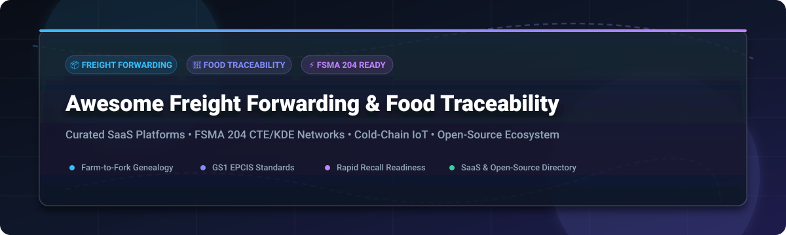

  

  
  
  
  
  
  

---

# 🚢 Awesome Freight Forwarding & Food Traceability Management

> **A curated ecosystem of SaaS platforms, FSMA 204 CTE/KDE compliance solutions, cold-chain IoT monitors, and open-source frameworks for global logistics & supply-chain transparency.**

This repository tracks notable enterprise **SaaS platforms** and production-grade **open-source repositories** for **Freight Forwarding, Logistics, and Food Traceability**. These systems capture Critical Tracking Events (CTEs) and Key Data Elements (KDEs), enable lot genealogy, enforce GS1/EPCIS interoperability standards, support rapid recall readiness, and deliver farm-to-fork visibility across growers, freight carriers, distributors, and retailers.

---

## 📌 Table of Contents

- [📊 Sector Market Size & Industry Structure](#-sector-market-size--industry-structure)
- [🏢 SaaS & Hosted Enterprise Platforms](#-saas--hosted-enterprise-platforms)
- [💻 Open-Source Repositories & Frameworks](#-open-source-repositories--frameworks)
- [💡 Key Traceability Standards & Regulations](#-key-traceability-standards--regulations)
- [🤝 How to Contribute](#-how-to-contribute)
- [💖 Support & Sponsorship](#-support--sponsorship)
- [📈 Star History](#-star-history)
- [⚠️ Disclaimer](#%EF%B8%8F-disclaimer)

---

## 📊 Sector Market Size & Industry Structure

> 💡 **Market Overview & Dynamics:**  
> The global **Food Traceability & Freight Logistics Software Market** is valued at an estimated **$18.5 Billion – $22.0 Billion** (2025–2026), projecting a compound annual growth rate (CAGR) of **9.2%**, propelled by mandatory **FDA FSMA Section 204** compliance deadlines, EU Deforestation Regulations (EUDR), and cold-chain IoT tracking demands.  
>  
> **Market Fragmentation:** The sector is **moderately fragmented**. Enterprise technology providers (IBM, ReposiTrak) command major market share for global retail compliance networks, while specialized domain SaaS solutions (TraceGains, FoodLogiQ/Trustwell, Wherefour) lead in specialized lot-genealogy, manufacturing ERP, biochemical verification, and temperature-sensitive freight transport.

---

## 🏢 SaaS & Hosted Enterprise Platforms

*Listed and sorted by estimated **Company Size / Revenue / Market Valuation** (Descending).*

| Logo / Platform | Focus & Key Capabilities | Company Size (Revenue / Valuation) | Starting Pricing (Est.) | Free Tier / Trial Limits |
| :--- | :--- | :--- | :--- | :--- |
| **[IBM Food Trust](https://www.ibm.com/products/food-trust)** | Enterprise permissioned blockchain network for multi-party supply chain traceability and document security. | **$60.5B** (IBM Corp Revenue) / Enterprise Business Unit | **$100 / month** (Tier 1 Small Business) | **Guided Sandbox & Interactive Demo** (No permanent free tier; sandbox evaluation available) |
| **[ReposiTrak](https://repositrak.com/)** | Compliance management, active QMS, and FSMA 204 CTE/KDE automated data exchange network. | **$150M** Market Cap / **$22.6M** Annual Revenue | **$59 / month** (Supplier Tier; Free for Retailers) | **Free Retailer/Wholesaler Network Access** (14-day interactive supplier demo) |
| **[TraceGains](https://www.tracegains.com/)** | Networked supplier compliance, ingredient specification management, and risk automation. | **$50M+** Total Funding Raised / **~$25M** Est. ARR | **$1,200 / month** (Base Network Starter Suite) | **TraceGains Gather® Freemium Tier** (Free entry tier for supplier network directory) |
| **[FoodLogiQ (Trustwell)](https://www.foodlogiq.com/)** | End-to-end CTE/KDE event capture, lot genealogy visualization, and instant recall management. | **$29.5M** Total Funding Raised / **~$18M** Est. ARR | **$1,500 / month** ($32,000 / year starting quote) | **14-Day Guided Sandbox Demo** (No self-serve free plan; full sandbox trial on request) |
| **[Safefood 360°](https://safefood360.com/)** | Food safety quality management system (QMS), HACCP planning, supplier audits, and lot tracking. | **~$12M** Est. Annual Revenue (Part of LGC Group) | **$500 / month** (Starter Manufacturing Module) | **14-Day Trial Evaluation** (Guided sandbox environment available for quality teams) |
| **[Parsyl](https://www.parsyl.com/)** | Cold-chain cargo monitoring, temperature IoT data logging, and cargo quality risk insurance. | **$40M+** Total Funding Raised / **~$8M** Est. ARR | **$250 / month** (Base Platform + $15/sensor) | **Free Hardware Demo Kit** (Evaluation trial pack available for qualified shippers) |
| **[iFoodDS](https://ifoodds.com/)** | Fresh food supply chain quality inspection, harvest tracking, and FSMA 204 compliance data network. | **~$8M** Est. Annual Revenue | **$400 / month** (Pro Traceability Tier) | **Guided Sandbox Evaluation** (Full interactive test environment upon request) |
| **[Wherefour](https://wherefour.com/)** | Cloud ERP and lot-genealogy tracking for food, beverage, and process manufacturing. | **$1.4M** Est. Annual Recurring Revenue (ARR) | **$600 / month** (Base ERP + Lot Tracking) | **20-Minute Tailored Sandbox Demo** (No self-serve free trial; live demo sandbox) |
| **[SafeTraces](https://www.safetraces.com/)** | DNA-based bio-taggants and diagnostic sanitation verification for physical food traceability. | **$20M+** Total Funding Raised / **~$2M** Est. ARR | **$500 / kit** (Assay Test Pack Starting Price) | **Pilot Trial Evaluation Program** (Qualifying facility trial assessment available) |

---

## 💻 Open-Source Repositories & Frameworks

*Curated production tools, blockchain ledgers, GS1 standards engines, and inventory management systems. Sorted by **GitHub Stars_Count** (Descending).*

| Project & Repository | Stars_Badge (Click to View Stargazers) | Description & Focus Area | Key Tech Stack |
| :--- | :---: | :--- | :--- |
| **[Hyperledger Fabric](https://github.com/hyperledger/fabric)** |  | Enterprise permissioned distributed ledger technology (DLT) framework widely used for food traceability and supply chain provenance. | Go, Docker, gRPC |
| **[OpenBoxes](https://github.com/openboxes/openboxes)** |  | Open-source warehouse logistics and supply chain inventory management system for tracking shipments, stock moves, and lot expiration. | Java, Grails, Groovy, MySQL |
| **[OpenEPCIS Event Hash Generator](https://github.com/openepcis/epcis-event-hash-generator)** |  | Core GS1 EPCIS 2.0 tool for generating deterministic canonical event hashes for Critical Tracking Events (CTEs) and Key Data Elements (KDEs). | Java, REST, JSON-LD, XML |
| **[OpenEPCIS Document Validation](https://github.com/openepcis/openepcis-document-validation-service)** |  | Validation service enforcing GS1 EPCIS 1.2/2.0 schema correctness and Core Business Vocabulary (CBV) compliance across supply chains. | Java, Quarkus, OpenAPI |
| **[Hyperledger Food Supply Chain](https://github.com/alexeipancratov/hyperledger-food-supply-chain)** |  | Farm-to-fork food traceability implementation leveraging Hyperledger Fabric smart contracts (chaincode) and Node.js REST APIs. | Node.js, Chaincode, Fabric |
| **[FoodTraze Network](https://github.com/hyperledger-foodtraze/foodtraze-network)** |  | Modular blockchain platform capturing farm harvest, lab test results, processing transformations, and consumer QR lookup timelines. | TypeScript, Fabric, React |
| **[Food Supply Chain Traceability App](https://github.com/MoigeMatino/food-supplychain-traceability-app)** |  | Decentralized Farm-to-Table application logging lot attributes, location checkpoints, and transport conditions onto an immutable ledger. | Solidity, Ethereum, Web3.js |
| **[Food Supply Chain Demo](https://github.com/Daniel-Szego/FoodSupplyChainDemo)** |  | Traceability model tracking lot splits/merges alongside greenhouse gas (GHG) footprint carbon metrics across freight stages. | JavaScript, Hyperledger Composer |

---

## 💡 Key Traceability Standards & Regulations

- 📜 **FDA FSMA 204 (Food Safety Modernization Act):** Mandates specific Critical Tracking Events (CTEs) such as Receiving, Transforming, and Shipping, along with Key Data Elements (KDEs) for designated high-risk foods.
- 🏷️ **GS1 EPCIS 2.0 (Electronic Product Code Information Services):** Global standard enabling interoperable sharing of physical event data ("what, where, when, and why").
- 🧬 **GS1 Digital Link:** Web URI standard connecting physical product barcodes directly to online traceability timelines and batch certificates.
- 🌡️ **Cold-Chain IoT Monitoring:** Automated logger integrations capturing continuous temperature, humidity, and location metadata.

---

## 🤝 How to Contribute

Contributions are warmly welcomed! Help keep this ecosystem comprehensive and accurate:

1. **Fork** this repository.
2. Add your SaaS or Open-Source project to `README.md` following the existing tabular structure.
3. Ensure links, pricing, free tier details, and repository Stars_Badges are verified.
4. Submit a **Pull Request** with a concise description of the addition.

For guidelines on list curation, visit [Awesome-Awesome-Awesome](https://github.com/ishandutta2007/Awesome-Awesome-Awesome).

---

## 💖 Support & Sponsorship

If you find this repository helpful for your supply chain, logistics, or compliance research, please consider supporting the project!

- ⭐ **Star this repository** to increase visibility.
- 🔀 **Fork & Share** with your colleagues and engineering teams.
- ☕ **Buy me a coffee / Sponsor:** Support ongoing maintenance via [GitHub Sponsors](https://github.com/sponsors/ishandutta2007).

  

---

## 📈 Star History

---

## ⚠️ Disclaimer

- This is a **community-curated list** provided for educational and informational purposes only.
- System pricing, features, and open-source project stats change over time; always check official vendor sites and project documentation for current specifications.
- Food traceability systems directly impact public health and regulatory compliance. Open-source software and tools are not a substitute for certified enterprise compliance programs.
